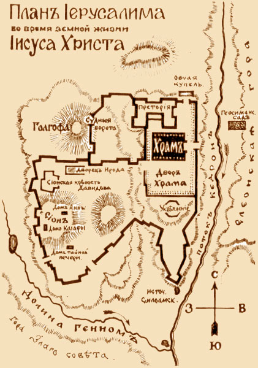

```markdown
<sup>0</sup> TEXT 

<note type="info" title="Толкования" collapsed="true">

<note type="quote" title="Автор" collapsed="true">

text
[link](./temp)

</note>

<note type="quote" title="Автор" collapsed="true">

text
[link](./temp)

</note>

<note type="quote" title="Автор" collapsed="true">

text

[link](./temp)

</note>

</note>
```

<sup>1</sup> TEXT

<note title="Дополнительно" collapsed="true">

<note type="info" title="Толкования" collapsed="true">

<note type="quote" title="Автор" collapsed="true">

text

</note>

<note type="quote" title="Автор" collapsed="true">

text

</note>

<note type="quote" title="Автор" collapsed="true">

text

[link](./_index)

</note>

</note>

<note type="info" title="Карты" collapsed="true">

{width=421px height=600px}

</note>

</note>

<sup>1</sup> TEXT [📖 Толкования](#толкования-1)\{.small-button} [🗺️ Карты](#карты-1)\{.small-button} [📚 Сравнить](#сравнить-1)\{.small-button}

<note title="Толкования" collapsed="true">

<note type="quote" title="Иоанн Златоуст (IV в.)" collapsed="true">

Толкование текст...

</note>

<note type="quote" title="Феофилакт Болгарский (XI в.)" collapsed="true">

Толкование текст... [Подробнее](./commentaries/theophylact)

</note>

</note>

<note title="Исторические карты" collapsed="true">


</note>